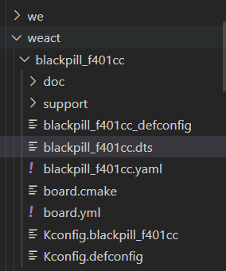

# Zephyr RTOS  

Useful links: 

[API Documentation](https://docs.zephyrproject.org/apidoc/latest/index.html)

## Getting Started

### 1. VSCode workspace

Open the zephyrproject folder (the folder where the virtual environment is created) in VSCode.

### 2. Creating a new Zephyr project (inside the west workspace)

Note: Projects can also be created outside of the west workspace. [Refer to this for adding project outside workspace](https://docs.zephyrproject.org/latest/develop/application/index.html)  

Create a folder with suitable project name (under zephyrproject folder).  
Inside your new project folder, add a "src" folder. That is where your main.c will reside.  
Additionally, add "app.overlay" , "CMakeLists.txt" and "prj.conf" files to your project folder.  
These are necessary files that should be included in every Zephyr project you create. 

## 3. Coding your project

Note: Always make sure your python virtual environment is activated before working with Zephyr projects  

Three points to keep in mind while developing software for a microcontroller:  
1. Understand what peripherals are needed and code the initialization of those peripherals.  
2. Code the algorithm   
3. Testing and debugging  
  
### 1. Initializing Peripherals

To initialize peripherals in Zephyr:  
First we should understand what is [DeviceTree](https://docs.zephyrproject.org/latest/build/dts/index.html). In short, it is a file type to describe hardware of Supported boards by zephyr. Devicetree is both a hardware description language and a configuration language for Zephyr. It helps you abstract actually setting up the hardware via registers, instead you are just supposed to give different parameters for your peripheral. The rest is taken care by the build.  
There are 2 types of Device tree files:
1. DeviceTree Sources (.dts,.dtsi,.overlay)
2. DeviceTree Bindings (.yaml)  

The .dts and .dtsi files are found in `zephyr/boards/<your_board_name>`, .overlay files are written in their respective projects ("app.overlay) along with .yaml files. 

DeviceTree sources contain all the peripherals of the board.

